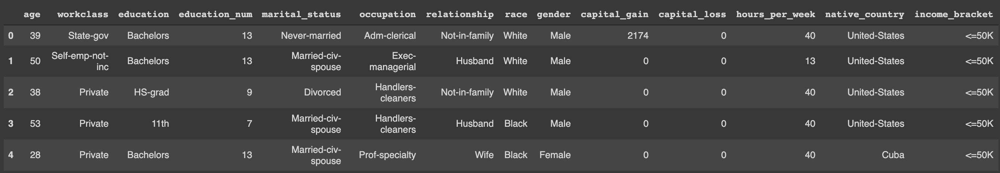

# Analysis of Census Data using Artificial Neural Network
This repository contains the implementation of artificial neural network in predicting the income of the employee based on several factors.

## Problem Statement
The U.S. Census Bureau provides demographic and economic data of their citizens. The census data of California has to be analysed to predict the class of income of the citizen they belong in (>50,000$ or <=50,000$) based on different factors, i.e. age, education, marital status, occupation, etc.

## Packages
This project is implemented in python. The following python-based packages are used:

* **tensorflow** : It is an open-source platform for machine learning and deep learning. It has a comprehensive, flexible ecosystem of tools, libraries and community resources that lets developers easily build and deploy ML/DL-powered applications. It offers building and training DL models easily using intuitive high-level APIs like Keras with eager execution, which makes for immediate model iteration and easy debugging. In this project, `LinearClassifier` is used to build a neural network and analyse the census data. [More Information](https://www.tensorflow.org/)

* **skikit-learn** : It is a collection of simple and efficient tools for predictive data analysis using supervised and unsupervised machine learning algorithms. It also contains the tools for data preprocessing, which is needed since the collected data is not always in the format which is required by the model. So, a little bit of preprocessing is needed to the dataset. In this project, `train_test_split` is used to split the preprocessed data into training dataset and the testing dataset. [More Information](https://scikit-learn.org/stable/index.html)

* **pandas** : It is a collection of tools for reading and writing data between in-memory data structures and different formats like CSV, text files, Microsoft Excel, SQL databases, and the fast HDF5 format. It uses a fast and efficient DataFrame object for data manipulation with integrated indexing. In this project, it is used to import the dataset, which is a CSV file. [More Information](https://pandas.pydata.org/)

* **numpy** : It is the fundamental package for scientific computing with python. It offers comprehensive mathematical functions, random number generators, linear algebra routines, Fourier transforms, and more. It provides powerful N-dimensional array, which is fast and versatile in the vectorisation, indexing, and broadcasting concepts for computing. In this project, the NumPy array is used to store the preprocessed dataset and perform mathematical operations. [More Information](https://numpy.org/)

## Dataset
The artificial neural network is used to analyse this problem for which a labelled data is required to train the model. The data is collected from (https://www.census.gov/), which tells the annual income of 32560 citizens from California along with their age, education, marital status, etc. A complete description of all the factors used as features are shown in the table below:

<table>
<thead>
<tr>
<th>Column Name</th>
<th>Type</th>
<th>Description</th>
</tr>
</thead>
<tbody>
<tr>
<td>age</td>
<td>Continuous</td>
<td>The age of the individual</td>
</tr>
<tr>
<td>workclass</td>
<td>Categorical</td>
<td>The type of employer the  individual has (government,  military, private, etc.).</td>
</tr>
<tr>
<td>fnlwgt</td>
<td>Continuous</td>
<td>The number of people the census  takers believe that observation  represents (sample weight). This  variable is not used.</td>
</tr>
<tr>
<td>education</td>
<td>Categorical</td>
<td>The highest level of education  achieved for that individual.</td>
</tr>
<tr>
<td>education_num</td>
<td>Continuous</td>
<td>The highest level of education in  numerical form.</td>
</tr>
<tr>
<td>marital_status</td>
<td>Categorical</td>
<td>Marital status of the individual.</td>
</tr>
<tr>
<td>occupation</td>
<td>Categorical</td>
<td>The occupation of the individual.</td>
</tr>
<tr>
<td>relationship</td>
<td>Categorical</td>
<td>Wife, Own-child, Husband,  Not-in-family, Other-relative,  Unmarried.</td>
</tr>
<tr>
<td>race</td>
<td>Categorical</td>
<td>White, Asian-Pac-Islander,  Amer-Indian-Eskimo, Other, Black.</td>
</tr>
<tr>
<td>gender</td>
<td>Categorical</td>
<td>Female, Male.</td>
</tr>
<tr>
<td>capital_gain</td>
<td>Continuous</td>
<td>Capital gains recorded.</td>
</tr>
<tr>
<td>capital_loss</td>
<td>Continuous</td>
<td>Capital Losses recorded.</td>
</tr>
<tr>
<td>hours_per_week</td>
<td>Continuous</td>
<td>Hours worked per week.</td>
</tr>
<tr>
<td>native_country</td>
<td>Categorical</td>
<td>Country of origin of the  individual.</td>
</tr>
<tr>
<td>income</td>
<td>Categorical</td>
<td>"&gt;50K" or "&lt;=50K", meaning whether the person makes more than $50,000 annually.</td>
</tr>
</tbody>
</table>

The sample of the first five rows are shown below by using `census.head()` command.

## Implemention

* In this project, the linear regression model is used to estimate the relationship between a dependent variable and one or more independent variables. [More Information](https://en.wikipedia.org/wiki/Regression_analysis) The dependent variable is the company's profit, and the independent variables are the company's expenditures.
* After preprocessing, the whole dataset is divided into training and testing dataset, i.e. 80% of training dataset and 20% of the testing dataset. 
* The training dataset is used to train the model, and then the model is used to predict the outcomes of the testing dataset, and the R2 score is calculated. The coefficient of determination or R2 score is the proportion of the variance in the dependent variable that is predictable from the independent variables. [More Information](https://en.wikipedia.org/wiki/Coefficient_of_determination)

## Result
The Regression model is trained successfully and can be used to predict the profit based on the different values of expenditures. The R2 score is found to be 0.91, which shows that the model shows a good result with the testing dataset.